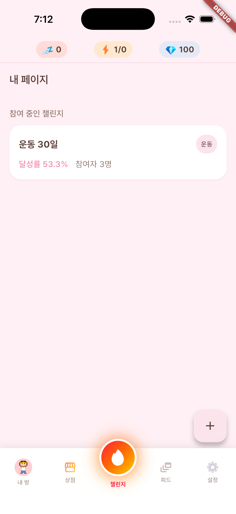

# Task Report: Room Decoration Phase 1+2 (P2)

## Request

"디자인 워크트리에서 구현 안한 기획문서 찾아서 깊이 파악 후 구현해줘" (사용자 요청 원문).

탐색 결과 `docs/design/room-decoration.md` (status: ready) 가 유일하게 미구현 상태인 디자인 스펙으로 확인됨. 협의 결과: Phase 1(백엔드 풀세트) + Phase 2(미니룸 에디터 UI) 먼저 완성, 소스오브트루스 문서 갱신, default/COMMON 아이템 1~2개씩 시드 포함.

## Root Cause / Context

`docs/design/room-decoration.md`는 방 꾸미기 P2 기능 전체를 커버하는 디자인 스펙이었으나, 직전 슬라이스(Room Speech 등)에서 다루지 않아 status: ready 상태로 유예되어 있었다.

기존 character/shop/item 시스템(아이템 소유 검증 에러 코드 `ITEM_NOT_OWNED` 등)을 최대한 재사용하여 신규 모델 3개 + 마이그레이션 1개 + 시드로 비용을 최소화하였다. 프론트는 기존 `miniroom_scene.dart`에 wall/floor variant 분기만 추가하고, 신규 `RoomDecoratorScreen`과 GoRouter 라우트를 연결하는 방식으로 기존 아키텍처와 통합하였다.

## Actions

### 소스오브트루스 문서 갱신

| 파일 | 변경 내용 |
|------|----------|
| `docs/prd.md` | F-31 Room Decoration 기능 항목 추가 (P2) |
| `docs/domain-model.md` | §2.10 RoomItem, §2.14 MiniroomSlot, §2.15 ChallengeRoomSlot, §2.16 RoomSignature 엔티티 추가 |
| `docs/api-contract.md` | §7 (내 방), §11 (챌린지 방) 신규 엔드포인트 5개 + `ITEM_NOT_OWNED` 재사용 명시 |

### Backend (Phase 1)

| 파일 | 유형 | 내용 |
|------|------|------|
| `server/app/models/room_item.py` | NEW | `RoomItem` SQLAlchemy 모델 |
| `server/app/models/miniroom_slot.py` | NEW | `MiniroomSlot` 모델 (UNIQUE user×slot_key) |
| `server/app/models/challenge_room_slot.py` | NEW | `ChallengeRoomSlot` 모델 (UNIQUE challenge×user×slot_key) |
| `server/app/schemas/room_decoration.py` | NEW | Pydantic v2 스키마 |
| `server/app/services/room_decoration_service.py` | NEW | 비즈니스 로직: 소유 검증, 슬롯 upsert, signature 장착 |
| `server/app/routers/room_decoration.py` | NEW | 5개 엔드포인트 APIRouter |
| `server/alembic/versions/20260419_0002_017_add_room_decoration.py` | NEW | revision `017` (down `016`): 3개 테이블 + 인덱스 + FK |
| `server/scripts/seed_room_items.py` | NEW | 시드 31 row |
| `server/tests/test_room_equip.py` | NEW | 장착 API 단위 테스트 (호스트 venv 셋업 후 실행 예정) |
| `server/app/models/__init__.py` | MOD | 3개 신규 모델 export 추가 |
| `server/app/main.py` | MOD | `room_decoration.router` 등록 |

### Frontend (Phase 2)

| 파일 | 유형 | 내용 |
|------|------|------|
| `app/lib/features/my_room/models/room_item.dart` | NEW | freezed `RoomItem` 모델 |
| `app/lib/features/my_room/api/room_decoration_api.dart` | NEW | dio 5개 엔드포인트 래퍼 |
| `app/lib/features/my_room/providers/room_decoration_provider.dart` | NEW | `RoomDecorationController` |
| `app/lib/features/my_room/screens/room_decorator_screen.dart` | NEW | 미니룸 에디터: 카테고리 탭 + 아이템 그리드 |
| `app/lib/features/my_room/widgets/room_item_grid.dart` | NEW | 아이템 선택 그리드 위젯 |
| `app/lib/features/my_room/widgets/decoration_slot_preview.dart` | NEW | 슬롯 미리보기 오버레이 |
| `app/lib/core/widgets/miniroom_scene.dart` | MOD | wall + floor variant 분기 추가 |
| `app/lib/features/my_room/screens/my_room_screen.dart` | MOD | FAB → `RoomDecoratorScreen` 진입 |
| `app/lib/core/router/router.dart` | MOD | `/my-room/decorate` GoRouter 라우트 추가 |

### 핵심 설계 결정

- **`ITEM_NOT_OWNED` 재사용**: 기존 shop/item 시스템 에러 코드 그대로 재사용. 신규 에러 코드 추가 없음.
- **슬롯 upsert**: `ON CONFLICT DO UPDATE` — 중복 INSERT 없이 단일 행 유지.
- **default 아이템 fallback**: GET 시 미장착 슬롯에 is_default=True 아이템을 뷰 레이어에서 표시. DB 행 생성 없음.
- **Phase 1+2 우선**: Phase 3~6는 챌린지 방 UI, signature UI, 보상 시스템, variant 콘텐츠 확장. 후속 슬라이스에서 구현.

## Verification

```
python3 -m py_compile (신규 서버 파일 6개): 통과 (exit code 0)
flutter analyze lib/: 0 errors, warning 2건 (info 수준)
flutter build ios --simulator: Built Runner.app 성공 (9.5s)
docker compose up --build -d backend: 컨테이너 healthy
GET /health: 200 OK
Alembic revision 017 (head): 적용 완료
room_items / miniroom_slots / challenge_room_slots 테이블: 존재 확인
시드 31 row 삽입: 카테고리별 분포 확인
5개 신규 엔드포인트 OpenAPI 노출: /me/room/miniroom, /me/room/miniroom/{slot},
  /challenges/{id}/room, /challenges/{id}/room/{slot}, /challenges/{id}/room/signature
iOS 시뮬레이터 앱 launch: 정상 (iPhone 17 Pro, PID 42762, 첫 화면 진입)
```

미완료:
- `test_room_equip.py` pytest 실행 — 호스트 venv 미설정. 후속 슬라이스에서 `uv sync` 후 실행.
- `RoomDecoratorScreen` UI 인터랙션 수동 검증 — 시뮬레이터 자동 입력 없음.
- 실제 토큰 end-to-end API 호출 — devLogin 환경 미연결.

## Follow-ups

- **Phase 3**: `ChallengeSpaceScreen`에 챌린지 방 꾸미기 UI 추가 (challenge room slot 편집기)
- **Phase 4**: Signature 슬롯 UI 구현 (`/challenges/{id}/room/signature`)
- **Phase 5**: 챌린지 완료 시 아이템 지급 보상 시스템 연동
- **Phase 6**: 계절 한정·이벤트 아이템 variant 콘텐츠 확장
- **호스트 pytest 환경**: `cd server && uv sync` 후 `uv run pytest tests/test_room_equip.py -v` 실행
- **프론트 위젯 테스트**: Phase 3 UI 구현 시 `room_decorator_screen_test.dart` 함께 추가
- **다른 워크트리 세션**: `.claude/` 변경 없으므로 재시작 불필요. `git rebase origin/main`으로 코드 동기화만 필요.

## Related

- 승인 계획: `~/.claude/plans/lucky-snuggling-boole.md`
- 설계 문서: `docs/design/room-decoration.md`
- Migration: `server/alembic/versions/20260419_0002_017_add_room_decoration.py`
- impl-log: `impl-log/feat-room-decoration-feature.md`
- test-report: `test-reports/room-decoration-feature-test-report.md`
- 스크린샷: `docs/reports/screenshots/2026-04-19-feature-room-decoration-01.png`
- 이전 슬라이스 (Room Speech): `impl-log/feat-room-speech-feature.md`, `docs/reports/2026-04-19-feature-room-speech.md`

## Screenshots


