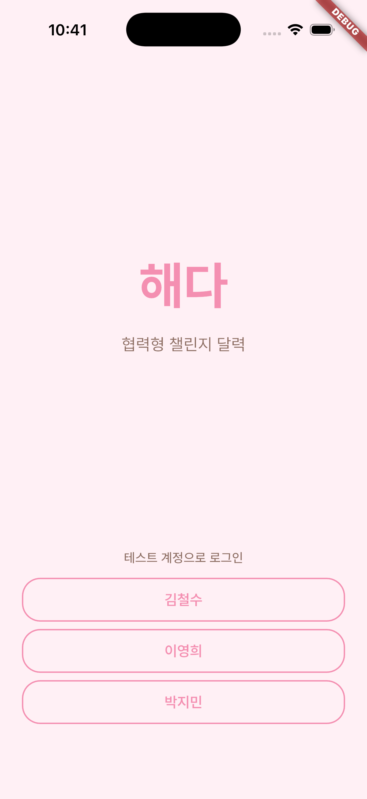

# Task Report: Challenge Room Speech Bubble (P2)

## Request

챌린지 방(ChallengeSpaceScreen) 미니룸의 캐릭터들이 **하얀 말풍선**으로 짧은 한마디를 주고받는 P2 기능 구현. 사용자 요청 및 설계 사양 `docs/design/challenge-room-speech.md` 기반.

- 유저당 챌린지당 발언 1건, TTL = 다음 day cutoff 시각
- round-robin 순차 표시 (각 발언 3회 × 3초, 다음 발언자로 교체)
- 내 캐릭터 롱-프레스(600ms) → `SpeechInputSheet` 바텀시트 진입
- 백엔드: GET/POST/DELETE `/api/v1/challenges/{id}/room-speech`, `room_speeches` 테이블 migration `016`

## Root Cause / Context

`challenge-room-social.md` 기반으로 캐릭터 배치·애니메이션·터치 인터랙션이 구현되었으나, 캐릭터 간 **텍스트 소통 수단**이 없었다. 말풍선 기능은 소셜 동기부여의 핵심 요소로, P2 확장으로 분류된 본 기능을 별도 설계 문서(`challenge-room-speech.md`)가 완성됨에 따라 구현에 착수하였다.

기존 `room_character.dart`의 `_WaveBubble`(탭 반응 👋 말풍선) 패턴을 일반화·확장하는 방식으로 충돌 없이 통합 설계됨.

## Actions

### Backend

| 파일 | 유형 | 내용 |
|------|------|------|
| `server/app/models/room_speech.py` | NEW | SQLAlchemy 2.0 async 모델, UNIQUE + INDEX 제약 |
| `server/app/schemas/room_speech.py` | NEW | Pydantic v2 요청·응답 스키마 |
| `server/app/services/room_speech_service.py` | NEW | 비즈니스 로직: 정규화·멤버십·rate limit·TTL·upsert·삭제 |
| `server/app/routers/room_speech.py` | NEW | GET/POST/DELETE 라우터 |
| `server/alembic/versions/20260419_0001_016_add_room_speech.py` | NEW | revision `016`: `room_speeches` 테이블 생성 |
| `server/tests/test_room_speech.py` | NEW | 12개 테스트 케이스 |
| `server/app/models/__init__.py` | MOD | `RoomSpeech` export 추가 |
| `server/app/main.py` | MOD | `room_speech.router` 등록 |
| `server/app/utils/time.py` | MOD | `next_cutoff_at` 헬퍼 + 30초 경계 가드 추가 |

### Frontend

| 파일 | 유형 | 내용 |
|------|------|------|
| `app/lib/features/challenge_space/models/room_speech.dart` | NEW | freezed + json_serializable 모델 |
| `app/lib/features/challenge_space/api/room_speech_api.dart` | NEW | dio 기반 GET/POST/DELETE 래퍼 |
| `app/lib/features/challenge_space/providers/room_speech_provider.dart` | NEW | `RoomSpeechController` + round-robin 큐 + `Timer.periodic` |
| `app/lib/features/challenge_space/widgets/speech_bubble.dart` | NEW | `SpeechBubble` 위젯 + 꼬리 `CustomPaint` + 애니메이션 |
| `app/lib/features/challenge_space/widgets/speech_input_sheet.dart` | NEW | 바텀시트: 40자 카운터, 말하기/지우기 버튼 |
| `app/lib/features/challenge_space/widgets/room_character.dart` | MOD | speech props 추가, `onLongPress` 연결 |
| `app/lib/core/widgets/challenge_room_scene.dart` | MOD | `RoomSpeechController` 생성·dispose, active state 분배 |
| `app/lib/features/challenge_space/screens/challenge_space_screen.dart` | MOD | 진입 시 `hydrate()` 호출 |
| `app/test/.../speech_bubble_test.dart` | NEW | 5개 테스트: 렌더·롱프레스·3회반복·opacity·접근성 |

### 주요 설계 결정

- **in-memory rate limit**: `_rate_cache: dict[str, datetime]` 모듈 수준 — 싱글 워커 MVP 전용
- **30초 경계 가드**: cutoff 직전 30초 내 입력 시 다음 cutoff로 expires_at 계산
- **단일 `Timer.periodic`**: 전체 큐를 하나의 타이머로 관리, 캐릭터별 개별 타이머 금지
- **하얀 말풍선 고정**: `Colors.white` + `Color(0xFF212121)` 텍스트 — 다크 모드에서도 불변

## Verification

```
pytest tests/test_room_speech.py: 12 passed
pytest (전체): 107 passed in 1.77s
flutter test (speech_bubble_test.dart): 5 passed
flutter test (challenge_space suite): 36 passed
flutter analyze: 0 errors (수정 파일 기준)
flutter build ios --simulator: Built Runner.app 성공
docker compose backend: 정상 재빌드
GET /health: 200 OK
alembic revision 016: 적용 완료, room_speeches 테이블 확인
Smoke GET /api/v1/challenges/.../room-speech: 401 (라우트 등록 확인)
iOS 시뮬레이터: 앱 기동 확인 (로그인 화면)
```

미완료: 실제 로그인 + 활성 챌린지 환경에서 말풍선 round-robin 수동 UX 확인 — **다음 세션 진행 예정**.

## Follow-ups

- **소스 문서 갱신 필요**: `docs/prd.md` (P2 기능 추가), `docs/api-contract.md` (3개 엔드포인트 + 4개 에러 코드), `docs/domain-model.md` (`RoomSpeech` 엔티티) — docs-protection hook이 차단할 수 있으므로 사용자 승인 후 진행. 차단 시 플래닝 문서(`docs/planning/`)에 임시 보관.
- **수동 UX 검증**: 시뮬레이터에서 로그인 후 챌린지 방 진입 → 말풍선 round-robin 동작, 롱프레스 입력, 지우기, 토스트 메시지 확인.
- **VisibilityDetector offstage pause**: 씬이 스크롤되어 화면 밖일 때 타이머 일시정지 미구현 (현재 AppLifecycleState만 처리). 추후 개선.
- **Redis rate limit**: 멀티 워커 배포 전환 시 in-memory → Redis 교체 필요.
- **다른 워크트리 세션 재시작**: 이 변경을 완전히 반영하려면 다른 세션을 재시작하거나 `git rebase origin/main` 실행 필요.

## Related

- 승인 계획: `~/.claude/plans/wondrous-riding-taco.md`
- 설계 문서: `docs/design/challenge-room-speech.md`
- 백엔드 구현 보고서: `docs/reports/2026-04-19-backend-room-speech.md`
- Migration: `server/alembic/versions/20260419_0001_016_add_room_speech.py`
- impl-log: `impl-log/feat-room-speech-feature.md`
- test-report: `test-reports/feat-room-speech-feature-test-report.md`
- 스크린샷: `docs/reports/screenshots/2026-04-19-feature-room-speech-01.png`

## Screenshots



## Post-Implementation Debugging Cycle (PR #13–#27 + cleanup)

초기 구현 PR #12 머지 후 사용자 시뮬레이터 검증 단계에서 후속 PR 들을 통해 다음 root cause 들이 순차로 드러났다. 자세한 단계별 흐름은 `impl-log/feat-room-speech-feature.md` §"Post-Implementation Debugging Journey", `test-reports/feat-room-speech-feature-test-report.md` §"Post-Implementation Manual Verification" 참조.

### 진짜 root cause 3개 (자동화 테스트가 못 잡았던 것)

1. **Riverpod autoDispose** (PR #24) — `@riverpod` default 가 autoDispose 라서 `authStateProvider` 가 my-page → 챌린지 방 navigation 사이 dispose → 재진입 시 `AsyncData(null)` 로 재생성되어 currentUserId 손실. **챌린지 방 안의 모든 isSelf 판정에 영향**. 수정: `@Riverpod(keepAlive: true)`
2. **DioException wrap unwrap 누락** (PR #26) — `ResponseInterceptor.onError` 가 `ApiException` 을 `DioException.error` 안에 wrap 하는데, `_submit` 이 `on ApiException catch` 만 가져 모든 서버 에러가 generic catch 로 빠짐. 수정: `on DioException catch` + `e.error is ApiException` unwrap
3. **TIMESTAMPTZ tz 불일치** (PR #27) — `room_speeches.expires_at` SQLAlchemy 모델에서 `Mapped[datetime]` 만 선언 → `TIMESTAMP WITHOUT TIME ZONE` 으로 판단됨. KST tz-aware datetime INSERT 시 asyncpg DataError. 수정: 모델에 `TIMESTAMP(timezone=True)` 명시 + 서비스 `datetime.now(tz=KST)` 통일

### 그 밖의 작은 우회 (PR #13–#23)

- long-press wrap 실패 (#13), `_speechParams` race condition (#14), 디자인 무시한 임의 UX 추가 (#15), 디자인 갱신으로 카톡식 입력 바로 전환 (#17), `myNickname` source 단일화 (#19), 키보드/송신 버튼 wiring (#21), 진단 hint 추가 (#23). 각 단계는 진짜 root cause 에 도달하기 위한 정보 수집이었음.

### 최종 cleanup PR

- 진단 hint (`로그인 정보 로딩 중`/`전송 실패: <CODE>`/`(HTTP $status)`) 를 친절한 표현으로 정리
- `_resolveUserId` / `_resolveNickname` 헬퍼 제거 (PR #24 keepAlive 로 더 이상 필요 없음)

## Lessons (다음 슬라이스 예방)

1. **Riverpod 전역 상태 → `keepAlive: true`** 명시
2. **dio + ResponseInterceptor 콜러는 `on DioException catch` + `e.error` unwrap**. `member_nudge_list.dart:52-67` 검증된 패턴
3. **PG TIMESTAMPTZ 컬럼은 모델에서도 `TIMESTAMP(timezone=True)`** 명시. SQLite 테스트로는 검출 불가 → docker compose 통합 검증 필수
4. **디자인 미확정 시 임의 UX 개선 금지**
5. **단일 source 원칙** — 같은 정보가 두 위젯에서 쓰이면 같은 source. 다르면 Riverpod family key 분기
6. **무반응 버그는 wiring 누락 가능성 우선 의심** — gesture/keyboard 같은 기술적 원인보다 callback 자체가 null 인 경우가 잦음
