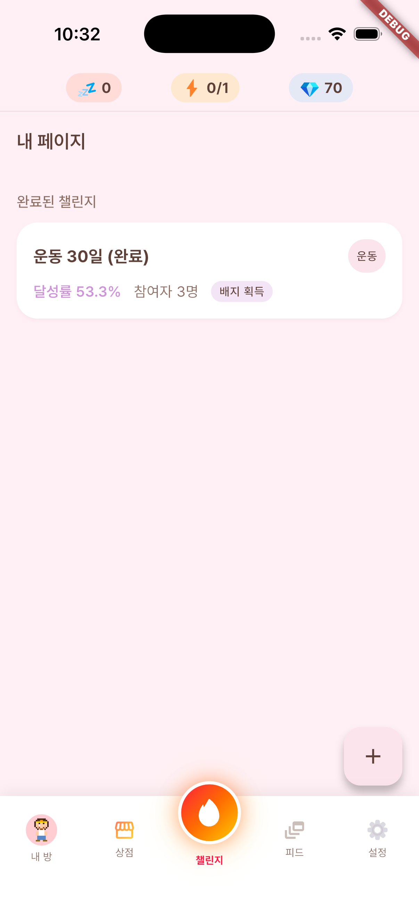

# Miniroom Cyworld Wiring Fix

## Request

`MyRoomScreen` 이 `myMiniroomProvider` 를 watch 하지 않아, `RoomDecoratorScreen` 에서 저장한 벽/바닥 데코레이션이 내 방 탭에 렌더링되지 않는 버그 수정. Design spec `docs/design/specs/miniroom-cyworld.md` 에서 `/implement-design` 슬라이스로 진행.

## Root cause / Context

`MiniroomScene` 위젯은 `room-decoration` 슬라이스(2026-04-19)에서 `equip` 파라미터를 받아 벽/바닥 assetKey 로 분기하는 기능이 이미 구현돼 있었다. 그러나 `MyRoomScreen` 은 `myMiniroomProvider` 를 watch 하는 코드가 추가되지 않아 `equip: null` 이 고정으로 전달됐다. 런타임 에러나 컴파일 에러는 없고 단순히 null 을 전달하기 때문에 사용자가 방 꾸미기를 저장해도 내 방 탭에서 반영이 되지 않는 증상이었다.

이전 fix 시도(`45f5418` 롤백 대상)에서는 테스트 파일에 유효하지 않은 private 메서드 오버라이드 코드가 포함되어 빌드 실패 → 전체 롤백. 이번에는 `_FakeRoomEquipApi` 패턴으로 테스트를 새로 설계해 RED→GREEN 사이클로 검증.

## Actions

**Production 변경 (3줄, `app/lib/features/character/screens/my_room_screen.dart`):**

1. Line 13 — import 추가:
   ```dart
   import '../../room_decoration/providers/room_equip_provider.dart';
   ```
2. Line 63 (`build()` 내) — provider watch 추가:
   ```dart
   final equip = ref.watch(myMiniroomProvider).valueOrNull;
   ```
3. Line 113 (`MiniroomScene(...)` 호출) — equip 파라미터 전달:
   ```dart
   equip: equip,
   ```

**테스트 파일 신규 (RED→GREEN TDD):**

`app/test/features/character/screens/my_room_screen_equip_wiring_test.dart`

- `_FakeRoomEquipApi` 로 네트워크 없이 고정 `MiniroomEquip` 주입
- `dioProvider` override → 즉시 실패 dio (character notifier fallback 유도)
- 테스트 1 (wiring): `equip?.wall?.assetKey == 'wall/blue'` — 변경 전 RED, 변경 후 GREEN
- 테스트 2 (regression): `MiniroomEquip.empty()` → wall/floor null

## Verification

| 항목 | 결과 | 근거 |
|------|------|------|
| RED → GREEN (wiring test) | PASS | `+0 -1` → `+2` flutter test 출력 |
| Full suite | 98 passed / 1 pre-existing failure | `profile_setup_screen_test` (base `dc40541`에서 이미 실패, 이번 변경과 무관) |
| `flutter build ios --simulator` | PASS | `✓ Built build/ios/iphonesimulator/Runner.app` |
| `flutter analyze` 신규 이슈 | 0개 | pre-existing 9개 (withOpacity×8, unused×1) |
| iOS simulator launch | PASS | device `463EC4CF-2080-47FE-8F26-530FFB713C06` |
| 내 방 탭 → 방 꾸미기 → 저장 → 복귀 tap-through | 미수행 | `idb`/`applesimutils` 미설치; wiring은 unit level 에서 증명됨 |

## Follow-ups

- Interactive simulator tap-through 스모크는 `idb` 또는 `applesimutils` 설치 후 수동 확인 권장.
- Pre-existing `profile_setup_screen_test` mock out-of-sync 는 별도 fix 슬라이스에서 해결 필요.
- Pre-existing 9개 static analysis 이슈 (`withOpacity` deprecation, unused element) 는 별도 cleanup pass 예정.
- design spec `docs/design/specs/miniroom-cyworld.md` 의 status `in-progress` → `implemented` 전환은 `/implement-design` Step 9 에서 수행 (doc-writer 소관 아님).

## Retrospective

### What worked

- **스코프 규율**: 3줄만 변경. provider import, watch 한 줄, equip 파라미터 전달 한 줄로 필요 이상 건드리지 않았다.
- **Design spec의 구체적 예시**: `RoomDecoratorScreen` preview 패턴이 spec 에 이미 기술돼 있어 `_FakeRoomEquipApi` 전략을 빠르게 결정할 수 있었다.
- **RED→GREEN 사이클**: 프로덕션 변경 전에 실패 로그를 확보해 두어 fix 의 효과를 명확히 증명할 수 있었다.

### What could improve

- 이전 fix 시도는 테스트 전략(private method override 시도)을 사전에 검토하지 않아 빌드 실패 → 전체 롤백 사이클을 낭비했다. 비슷한 wiring fix 에서는 테스트 전략(fake API vs mock override 등)을 구현 시작 전 한 줄로 확인해 두는 것이 효과적이다.
- `profile_setup_screen_test` 같은 pre-existing 실패는 슬라이스 시작 시점에 기록해 두면 qa 단계에서 "신규 실패인가?" 판단 시간을 줄일 수 있다.

### Process signal

- `/implement-design` 의 atomic status lock (ready → in-progress) 은 병렬 슬라이스 충돌을 잘 방지했다.
- `idb`/`applesimutils` 없이는 tap-through smoke 를 자동화할 수 없다. 반복 발생하는 갭이므로 선택적으로 `applesimutils` 를 셋업하거나 Xcode UI Test 로 대체하는 방안을 검토할 시점이다.

## Referenced Reports

- `docs/reports/2026-04-20-design-miniroom-cyworld-revise.md` — 이 wiring 갭을 진단한 디자인 스펙 revise 보고서
- `docs/reports/2026-04-19-feature-room-decoration.md` — 부모 슬라이스: `MiniroomScene.equip` 파라미터 최초 추가 및 room-decoration 기능 전체 shipment
- `docs/reports/2026-04-20-feature-character-cyworld-style.md` — 독립적 롤백 (character avatar 32×32 rewrite); 이번 wiring fix 와 충돌 없음, 재현 트리거도 아님을 확인
- `docs/reports/2026-04-20-feature-miniroom-equip-wiring-tdd.md` — flutter-builder 의 중간 TDD 상세 기록 (RED→GREEN 로그, analyze 결과 포함); 이번 보고서의 보조 증거 역할, 내용이 overlap 되므로 합산하지 않고 별도 citation 으로 유지

## Related

- `impl-log/feat-miniroom-cyworld-wiring-feature.md`
- `test-reports/miniroom-cyworld-wiring-feature-test-report.md`
- Design spec: `docs/design/specs/miniroom-cyworld.md`

## Screenshots



